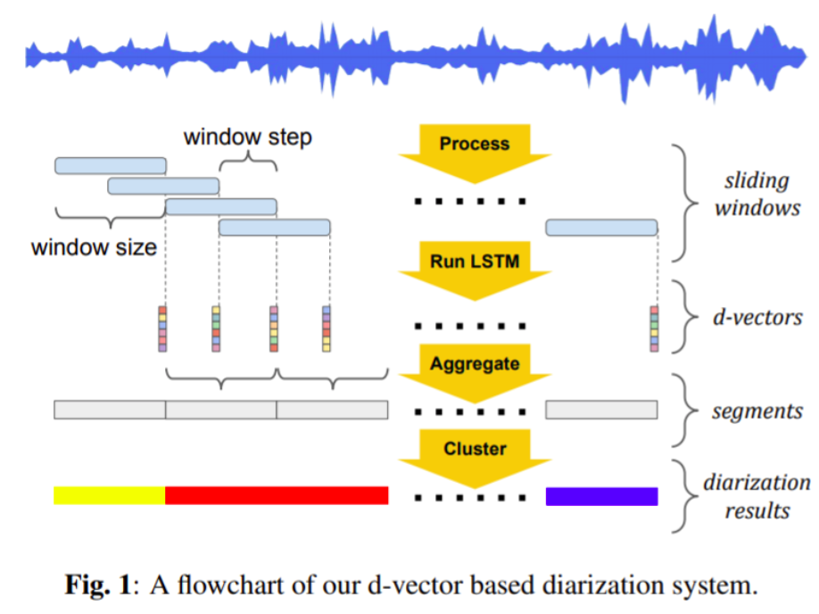
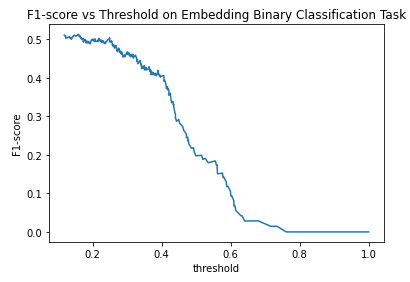
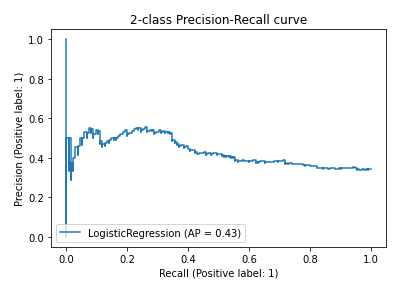

# Project Summary

This project contains two parts
1. Depression Classification
2. Speaker Diarization: <br/>
        Speaker Diarization experiments are implemented for the purpose to obtain more data from the raw audio to alleviate the work for frame level speaker annotation. More specific, the performance is not only evaluated based on Diarization Error Rate (DER), but also based on the performance on how well the patient audio can be extracted with high confidence.

Notation: Since the final target of this project is to detect the depression emotion of patient. Therefore, evaluate the confidence of extract patient audio is crucial for the model, even more important than DER. For patient analysis, we use precision, recall and F1-score to evaluate the model about the performance on extract high-confidence patient audio. Precision is the duration of correct detected patient audio divided by the detected patient audio. Recall is the duration of correct detected patient audio divided by the total duration in test set. And F1-score is the balanced metrics for Precision and Recall. 
        
        
# Section
## 1. Depression Classification


## 2. Speaker Diarization

### 2.1 Dataset
The dataset we used so far contains 126 files in total, 100 hours approximately. Each sample is a meeting between a doctor and a female patient. The ratio of doctor gender is around 7 (female) : 3  (male). The quality is classified into four groups, namely excellent, good, and average. The ratio of audio quality is 7 (excellent) : 3 (good/average/bad). 
```markdown
| Qualtiy        | Description               |  
| -------------- |:-------------------------:|
| Excellent      | clear, no noise, no echo  |
| Good           | clear, a little noise     | 
| Average        | clear, accompanying noise | 
```
The dataset is split into train-dev-test in ratio 92:22:12 with the quality ratio and gender ratio be 7 : 3 for all of them. 


### 2.2. Experiment

Classification Experiments:

Diarization experiments are implemented using Pyannote-audio toolbox. For speaker activity detectiona and speaker change detection, those are frame-level binary classification task using LSTM based neural network to determine whether there is a speech within the frame, and whether there is a speaker change accordingly. The speaker embedding block is a x-vector extractor. Finally, the segment-wise speaker embedding vectors are clustered to get the final diarization results across time. Sample pipeline structure is shown below in Figure.


In all preliminary experiments, models are well-trained on DIHARD dataset which has multiple hard-diarized meeting corpus. In pilot study, model trained on AMI and DIHARD are compared in advanced. And we found that DIHARD matches this project better. So all following experiments are implemented based on this. And the baseline is the DIHARD model not finetuned on our dataset.   

#### 2.2.1. Pipeline Finetuning
```markdown


```
#### 2.2.2. Block Finetuning

Since the conventional speaker diarization pipeline contains blocks as speaker activity detection, speaker change detection, and speaker embedding block. This approach is to use the groundtruth data to finetune the model pretrained with DIHARD dataset for each block separately. And then do the pipeline finetuning jointly at the final stage. 
```markdown
Diarization Results
| Exp                    | DER           | False Alarm  | Miss Detected | Confusion |
| ---------------------- |:-------------:| ------------:|---------------|-----------|
| Baseline               | 66.86         |              |               |           |
| Pipeline Finetune      | 41.97         | 8.99         | 10.95         | 22.02     |
| Block Finetune         | 43.8          | 10.13        | 9.13          | 24.54     | 

``` 
```markdown
Patient Analysis
| Exp                    | Precision     | Recall       | Fscore        |  
| ---------------------- |:-------------:| ------------:|---------------|
| Pipeline Finetune      | 63.88         | 24.66        | 35.58         |
| Block Finetune         | 47.44         | 33.6         | 39.34         | 

``` 

#### 2.2.3. Two Centriods AHC Reformulation
Unlike conventional diarization task that the system has to determine the number of speaker by itself. In this project, each sample is a two-speaker utterance. Thus, we restrict the number of centriod to be 2 to simplify the problem.

```markdown
| Exp                    | DER           | False Alarm  | Miss Detected | Confusion |
| ---------------------- |:-------------:| ------------:|---------------|-----------|
| Baseline               | 66.86         |              |               |           |
| Block Finetune         | 43.8          | 10.13        | 9.13          | 24.54     | 
| Block Finetune AHC     | 43.75         | 5.19         | 20.63         | 17.93     |
| Block Finetune AHC TFS | 39.88         | 4.78         | 16.16         | 18.94     |     

``` 
```markdown
Patient Analysis
| Exp                    | Precision     | Recall       | Fscore        |  
| ---------------------- |:-------------:| ------------:|---------------|
| Block Finetune         | 47.44         | 33.6         | 39.34         | 
| Block Finetune AHC     | 75.06         | 13.2         | 22.45         |
| Block Finetune AHC TFS | 71.53         | 14.3         | 23.85         |

```

#### 2.2.4. Mandrain Corpus Embedding Pretraining
Since DIHARD pretrained model is based on English, to mitigate the language mismatch, we retrain the embedding model on CN-Celeb dataset (about 300 hours), and keep the other two tuned blocks to be identical.

```markdown
| Exp                    | DER           | False Alarm  | Miss Detected | Confusion |
| ---------------------- |:-------------:| ------------:|---------------|-----------|
| Baseline               | 66.86         |              |               |           |
| Block Finetune         | 43.8          | 10.13        | 9.13          | 24.54     | 
| Block Finetune AHC     | 43.75         | 5.19         | 20.63         | 17.93     |
| + CN_pretrain          | 44.14         | 11.62        | 7.98          | 24.54     |
| + Finetune             | 44.91         | 2.77         | 30.36         | 11.78     |
```

```markdown
Patient Analysis
| Exp                    | Precision     | Recall       | Fscore        |  
| ---------------------- |:-------------:| ------------:|---------------|
| Block Finetune         | 47.44         | 33.6         | 39.34         | 
| Block Finetune AHC     | 75.06         | 13.2         | 22.45         |
| + CN_pretrain          | 81.78         | 17.4         | 28.80         | 
| + Finetune             | 78.92         | 36.21        | 49.64         |
```

#### 2.2.5. Doc vs Patient Binary Classification Reformulation
Step further from the centroid-restrict clustering, we come up with a simplier binary classification model to replace the AHC clustering. Performance is evaluated purly on the patient perspective, i.e. how well the model can extract the patient audio with relatively higher confidence.

```markdown
Patient Analysis
| Exp                    | threshold     | Precision    | Recall        | Fscore        |  
| ---------------------- |:-------------:| ------------:|---------------|---------------|
| Logistic Regression    |  0.5          | 34.57        | 21.6          | 26.59         | 
|                        |  0.8          | 31.09        | 2.49          | 4.56          |
|                        |  0.98         | 96.62        | 0.37          | 0.74          | 
| ---------------------- |:-------------:| ------------:|---------------|---------------|
| Quadratic DA           |  0.5          | 47.44        | 43.36         | 42.63         | 
|                        |  0.8          | 75.06        | 33.92         | 36.7          |
|                        |  0.98         | 81.78        | 31.56         | 34.83         | 
| ---------------------- |:-------------:| ------------:|---------------|---------------|
| KNN                    |               | 47.44        | 44.85         | 42.17         | 
```

The Precision vs Recall Curve and F1 vs Threshold Curve are as shown below in Figure.





### Discussion and Conclusion

Depression Classification

Speaker Diarization: <br/>
        - From experiments result shown above, we found that, most approaches boost the patient extraction performance greatly by boosting the precision and recall score. By restricting the number of cluster centroids, the precision is boost from 47.44 to 75.06, by sacrifying the recall score in half. One step further, after training the speaker embedding block using large Mandrain corpus, we boost the precision from 75.06 to 78.92, and the recall is also doubled, which is also the best result we have and applied to the pilot study. The final stage experiment, binary classification doesn't bring any performance improvement. One hypothesis is that two speaker embedding vectors doesn't hold similar distribution across all utterance since speakers in all utterances are different. Also, due to the characteristic of this dataset, only relative speaker id is available, which means even utterance1 and utterance2 share the same speaker, they will be labeled as different set of speakers when training the embedding block and testing on it. Therefore, a trained binary classification model can not capture this relatively difference better than clustering method. From the precision vs recall curve and F1-score vs threshold curve, we can also see a highly screwed shape for both of them.      
       - The model with best performance on extracting high confidence patient audio can achieve preciation as 78.92 with a comparable recall as 36.21. The patient audio in pilot study (around 500 files) are extracted using this model. And we are still waiting for the feature-domain evaluation for gene analysis from another group.  
      - The group has already determined the next step for this project, which is detecting depression with short but precise patient audio around 1:30 minutes to 2:30 minutes for each patient. It can still alleivate the work for annotating entire audio. 
     


### Contact

Jinhan Wang: wang7875@g.ucla.edu
